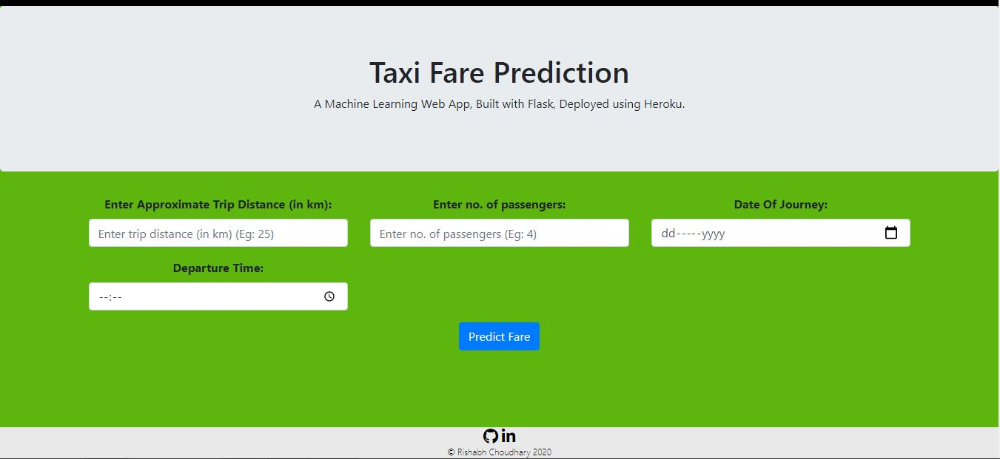

# New-York-Taxi-Fare-Prediction

 

## Project Objectives :
The objective of the project is to create a machine learning model. We are doing a supervised learning and our aim is to do predictive analysis to predict housing price.

## Data Collection :
The dataset is obtained from Kaggle. 

Link: https://www.kaggle.com/c/new-york-city-taxi-fare-prediction/data

Given its large size, the dataset was sampled to get a reasonable sized dataset.

## Modelling :
The analysis and model creation can be found in the .ipynb file. 

The main packages used are numpy, pandas, matplotlib, seaborn and sklearn.  

## Deployemnt :
The web app has been build using basic HTML, CSS, Javascript, Flask and Herkou.

Link: https://new-york-taxi-fare-predict.herokuapp.com/

## Future Scope :
* Use multiple Algorithms
* Optimize Flask app.py
* Update the Front-End 
